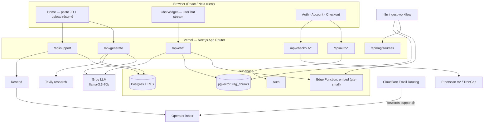
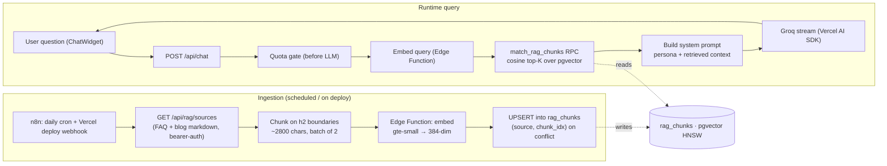

# kairesume — AI ATS resume builder + RAG chat assistant

[](https://kairesume.fit)

**kairesume** is a production web app that rewrites a résumé against any job description, scores it for ATS keyword match, drafts a tailored cover letter, and answers product/résumé questions through a **retrieval-augmented (RAG) chat assistant** — all on a deliberately **$0 infrastructure budget**.

> Live: **https://kairesume.fit**

---

## What it does

- **ATS-optimized résumé rewrite** — pastes a job description + your résumé (PDF/DOCX) and returns an ATS-clean rewrite tuned to the JD's keywords.
- **Tailored cover letter** — a 3–4 paragraph letter, optionally enriched with live company research (Tavily).
- **ATS match score** — 0–100 with matched / missing keyword breakdown.
- **Download bundle** — a ZIP with résumé + cover letter as both PDF and DOCX.
- **RAG chat assistant** — a floating widget that answers support / résumé-advice / pre-sales questions, grounded in the site's FAQ + blog via vector search.
- **Accounts, quotas, payments** — Supabase auth, free-tier quotas, and Pro upgrades paid in USDT (TRC-20 / ERC-20), verified on-chain.

---

## Tech stack

| Layer | Choice |
|---|---|
| Framework | Next.js 14 (App Router) + TypeScript |
| Styling | Tailwind CSS |
| Auth + DB | Supabase (Postgres + Auth + **pgvector** + Edge Functions) |
| LLM | Groq · `llama-3.3-70b-versatile` |
| Chat streaming | Vercel AI SDK 4 (`ai`, `@ai-sdk/groq`) |
| Embeddings | `gte-small` (384-dim) via a Supabase Edge Function |
| Ingestion orchestrator | n8n (schedule + deploy webhook) |
| File extraction | `pdf-parse` (PDF) · `mammoth` (DOCX) |
| Document render | `html2pdf.js` (PDF) · `@turbodocx/html-to-docx` (DOCX) |
| Payments | Etherscan V2 (EVM) + TronGrid (TRC-20) |
| Email | Resend (support notifications) + Cloudflare Email Routing (inbound) |
| Hosting / CDN | Vercel + Cloudflare |

---

## System architecture



---

## The RAG chat assistant (deep dive)

The assistant answers three kinds of questions — **support**, **résumé advice**, and **pre-purchase / sales** — and grounds its answers in the site's own FAQ + blog so it doesn't hallucinate product facts. It's split into an **offline ingestion** pipeline and a **runtime query** path.



### How retrieval works
1. **Corpus** — `content/faq.md` + the MDX blog posts are the knowledge base.
2. **Ingestion** — an n8n workflow (daily + on every production deploy) calls a bearer-protected `/api/rag/sources`, chunks the markdown on `##` headings (~2800-char windows, 400 overlap), embeds each chunk via a Supabase Edge Function, and bulk-UPSERTs vectors into the `rag_chunks` table. Re-runs are idempotent (unique `(source, chunk_idx)`), and stale rows from removed content are pruned.
3. **Query** — `/api/chat` embeds the user's latest message with the same model, runs a cosine top-K search via the `match_rag_chunks` SQL function (pgvector + HNSW index), injects the retrieved passages into a 3-persona system prompt, and streams the answer from Groq through the Vercel AI SDK to the `useChat` widget.
4. **Quota** — gated **before** the LLM call: anonymous 5/day (signed cookie), free signed-in 50/day (DB counters, lazy UTC reset), Pro/Staff unlimited.
5. **Graceful degradation** — if retrieval is unavailable, the chat still answers from the system prompt instead of erroring.

### Design decisions worth highlighting
- **$0 budget end to end.** Vector store is pgvector inside the existing Supabase; embeddings run on Supabase's built-in `gte-small` Edge runtime (no embedding API bill); inference reuses the existing Groq key; orchestration is n8n's free tier.
- **Embeddings moved off Vercel.** The first attempt ran a local embedding model in a Next route; its ONNX runtime (~513 MB) blew Vercel's 250 MB function limit. Moving embeddings to a Supabase Edge Function fixed it.
- **One shared secret, three places.** A single `RAG_INGEST_TOKEN` (constant-time compared) gates `/api/rag/sources`, the embed Edge Function, and the n8n credential.
- **Free-tier embed limit.** The Edge Function reliably embeds **2 inputs per call** (≥3 hits a compute limit), so ingestion batches in twos — a real constraint discovered and tuned in production.

---

## Project structure

```
app/
  api/
    chat/route.ts            # RAG chat — quota gate → retrieve → Groq stream
    rag/sources/route.ts     # bearer-protected corpus feed for n8n
    generate/route.ts        # main résumé + cover-letter pipeline
    auth/* checkout/* support/* usage/*
  page.tsx  layout.tsx        # home + root layout (metadata, JSON-LD)
components/
  ChatWidget.tsx             # floating assistant (Vercel AI SDK useChat)
  SupportWidget.tsx          # support form (reused by "Talk to a human")
  ResumePreview.tsx ATSScore.tsx ...
lib/
  rag/
    retrieve.ts              # embed query + match_rag_chunks RPC
    systemPrompt.ts          # 3-persona prompt + context injection
    chatQuota.ts             # per-day quota (anon cookie + DB counters)
  chatUsage.ts               # anonymous chat cookie
  llm.ts prompts.ts pricing.ts plan.ts crypto.ts ...
supabase/
  functions/embed/index.ts   # gte-small embeddings Edge Function
  migrations/                # 014 rag_chunks · 015 chat quota · 016 match RPC
content/
  faq.md  blog/*.mdx          # RAG corpus
docs/                        # ARCHITECTURE · DECISIONS · CURRENT_STATE · TASKS
```

---

## Local development

```bash
npm install
cp .env.local.example .env.local   # fill in the keys below
npm run dev                         # http://localhost:3000
```

### Key environment variables

| Variable | Purpose |
|---|---|
| `GROQ_API_KEY` | LLM (résumé generation + chat) — **required** |
| `NEXT_PUBLIC_SUPABASE_URL` / `_PUBLISHABLE_KEY` | Supabase client — **required** |
| `SUPABASE_SECRET_KEY` | Admin client (payments, RAG retrieval) — **required** |
| `USAGE_COOKIE_SECRET` | HMAC for quota / anon cookies — **required** |
| `RAG_INGEST_TOKEN` | Shared bearer for `/api/rag/sources` + embed Edge Function |
| `RESEND_API_KEY` + `SUPPORT_NOTIFY_EMAIL` | Support-ticket email notifications (optional) |
| `TAVILY_API_KEY` | Cover-letter company research (optional) |
| `OWNER_USDT_*_ADDRESS`, `ETHSCAN_API_KEY`, `TRONGRID_API_KEY` | Crypto checkout (optional) |

See [`docs/CURRENT_STATE.md`](docs/CURRENT_STATE.md) for the full list and [`docs/ARCHITECTURE.md`](docs/ARCHITECTURE.md) for the deep architecture.

### Scripts

| Command | Description |
|---|---|
| `npm run dev` | Dev server |
| `npm run build` | Production build |
| `npm run start` | Serve the build |

---

## Deployment

Pushing to `master` auto-deploys on Vercel. The RAG pipeline additionally needs (one-time): migrations `014`–`016` applied on Supabase, the `embed` Edge Function deployed (`supabase functions deploy embed --no-verify-jwt`), `RAG_INGEST_TOKEN` set in all three places, and the n8n ingest workflow active.

---

## ATS output rules (do not regress)

✅ Standard headings, exact JD keywords, simple HTML (`<h2> <h3> <p> <ul> <li> <strong>`), quantified bullets, action verbs.
❌ No tables, columns, graphics, headers/footers, or keyword stuffing — most ATS parsers fail on those.

---

## License

MIT.
